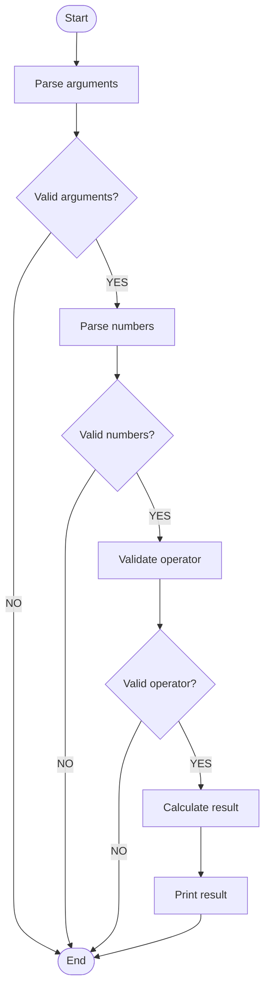

# Agent5 Quick Start Guide

Get started with Agent5 in 5 minutes!

## Prerequisites

- Python 3.11 or higher
- Ollama installed and running

## Step 1: Install Dependencies

```bash
cd Agent5
python -m venv .venv

# Windows
.venv\Scripts\activate

# Linux/Mac
source .venv/bin/activate

pip install -r requirements.txt
```

## Step 2: Install Ollama Models

```bash
# Chat model (choose one)
ollama pull qwen3:8b          # Recommended
# OR
ollama pull qwen2.5-coder:7b  # Alternative

# Embedding model (required)
ollama pull jina/jina-embeddings-v2-base-en
```

## Step 3: Try the Example

### Generate a Flowchart

```bash
python -m agent5 flowchart \
  --file examples/simple_calculator.cpp \
  --out calculator_flow.mmd
```

**Output:**
```
═══ Agent5: Generate Flowchart ═══

Input: examples/simple_calculator.cpp
Output: calculator_flow.mmd
Function: Auto-detect
Max steps: 30
Use LLM: False

Extracting Scenario Flow Model (SFM)...

✓ Flowchart generated successfully
  Nodes: 12
  Edges: 14
  Output: calculator_flow.mmd
  SFM (debug): calculator_flow.sfm.json
```

### View the Flowchart

1. **Option 1 - Mermaid Live Editor:**
   - Go to https://mermaid.live/
   - Paste contents of `calculator_flow.mmd`

2. **Option 2 - VS Code:**
   - Install "Markdown Preview Mermaid Support" extension
   - Create a markdown file with:
     ````markdown
     ```mermaid
     (paste calculator_flow.mmd contents here)
     ```
     ````

## Step 4: Index Your C++ Project

```bash
# Example: Index a sample project
python -m agent5 index \
  --project_path /path/to/your/cpp/project \
  --collection my_project \
  --clear
```

**Output:**
```
═══ Agent5: Index C++ Project ═══

Indexing project: /path/to/your/cpp/project
Collection: my_project
Clearing existing collection...
Building AST-aware document chunks...
Found 234 semantic chunks
Adding documents to vector store...
Indexing: 100%|████████| 3/3 [00:05<00:00, 1.85s/it]

✓ Indexed 234 documents
Collection: my_project
```

## Step 5: Ask Questions

```bash
python -m agent5 ask \
  --collection my_project \
  --question "How does the system initialize?"
```

**Output:**
```
═══ Agent5: Ask Question ═══

Question: How does the system initialize?

Answer:
The system initialization follows these steps:

1. main() function calls InitializeSystem() (source: src/main.cpp)
2. InitializeSystem() performs:
   - Loads configuration from config.json (source: src/init.cpp)
   - Initializes logging subsystem (source: src/init.cpp)
   - Creates ThreadPool with 8 threads (source: src/threadpool.cpp)
   - Registers signal handlers (source: src/init.cpp)
3. Returns 0 on success, -1 on failure (source: src/init.cpp)

The initialization is synchronous and must complete before the main event loop starts.
```

## Common Use Cases

### 1. Flowchart from Specific Function

```bash
python -m agent5 flowchart \
  --file src/request_handler.cpp \
  --out handler_flow.mmd \
  --function handleRequest
```

### 2. Ask with Focus File

```bash
python -m agent5 ask \
  --collection my_project \
  --question "Explain the request handling flow" \
  --focus src/request_handler.cpp \
  --project_path /path/to/project
```

### 3. Complex Flowchart with LLM

```bash
python -m agent5 flowchart \
  --file src/complex_handler.cpp \
  --out complex_flow.mmd \
  --max_steps 50 \
  --use_llm \
  --chat_model qwen3:8b
```

## Configuration

Set environment variables for defaults:

```bash
# ~/.bashrc or ~/.zshrc

export OLLAMA_BASE_URL="http://localhost:11434"
export OLLAMA_CHAT_MODEL="qwen3:8b"
export OLLAMA_EMBED_MODEL="jina/jina-embeddings-v2-base-en"
export CHROMA_DIR=".chroma"
```

## Troubleshooting

### "Ollama model not found"

```bash
# Check available models
ollama list

# Pull required models
ollama pull qwen3:8b
ollama pull jina/jina-embeddings-v2-base-en
```

### "Cannot build SFM"

- Make sure the file contains actual function implementations (not just declarations)
- Try specifying `--function` explicitly
- Simplify the code (complex macros/templates may confuse parser)

### "No documents found"

- Check that `--project_path` points to C++ code (`.cpp`, `.h`, `.hpp`)
- Verify files are not in excluded directories (build/, .git/, etc.)

## Next Steps

1. **Read the full README.md** for detailed documentation
2. **Try on your C++ project** and report issues
3. **Read IMPROVEMENTS.md** to understand advantages over Agent3
4. **Contribute** improvements and bug fixes

## Quick Reference

```bash
# Index project
python -m agent5 index --project_path <path> --collection <name> --clear

# Ask question
python -m agent5 ask --collection <name> --question "..."

# Generate flowchart
python -m agent5 flowchart --file <file.cpp> --out <output.mmd>

# Get help
python -m agent5 --help
python -m agent5 index --help
python -m agent5 ask --help
python -m agent5 flowchart --help
```

## Example Output

### Flowchart Example (Mermaid)



---

**You're ready to use Agent5! 🚀**

For questions or issues, refer to README.md or open an issue on GitHub.

