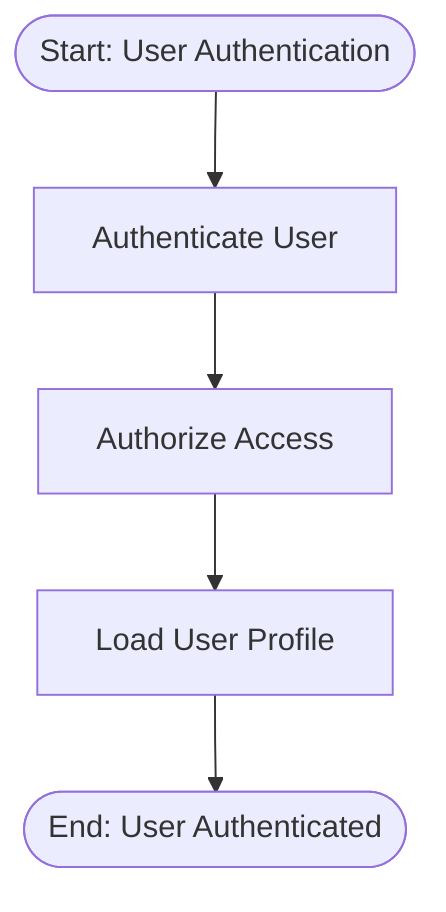
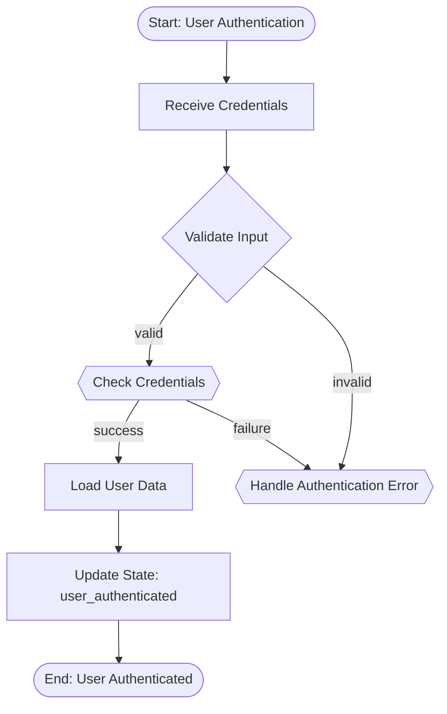
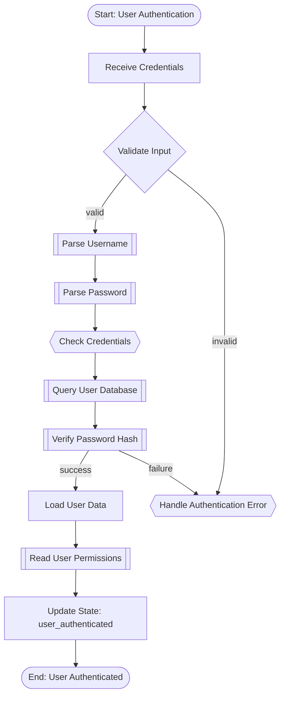

# Agent5 V4: Bottom-Up Semantic Aggregation for C++ Flowcharts

## Overview

Agent5 V4 is an advanced C++ documentation tool that generates **scenario-based flowcharts** using a **bottom-up semantic aggregation approach** inspired by DocAgent's docstring synthesis pipeline.

Unlike traditional function-call diagrams, Agent5 V4 produces **logical execution flows** that represent what the code **does**, not just what functions it calls.

## Key Features

### 🎯 Bottom-Up Semantic Understanding
- **Stage 1**: Full AST + CFG extraction using Clang (NO LLM)
- **Stage 2**: Leaf-level semantic extraction (atomic actions)
- **Stage 3**: Bottom-up semantic aggregation with LLM assistance
- **Stage 4**: Scenario Flow Model construction
- **Stage 5**: Rule-based detail-level filtering
- **Stage 6**: Strict Mermaid translation

### 📊 Multi-Level Detail Support
- **High**: Business-level steps only, suitable for architecture overview
- **Medium**: Include all validations, decisions, and state changes (default)
- **Deep**: Expand critical sub-operations affecting control flow or state

### 🎪 Project-Wide Analysis
- Entry point is used ONLY for locating the starting function
- Analysis scope is ALWAYS the entire project
- Follows scenario logic across files and modules

### 🔍 Entry-Point Disambiguation
- `--entry-function` to specify the entry point
- `--entry-file` to disambiguate when multiple functions have the same name
- Auto-detection when entry point is clear

## Installation

```bash
# Clone repository
git clone <repo-url>
cd Agent5

# Create virtual environment
python -m venv .venv
source .venv/bin/activate  # On Windows: .venv\Scripts\activate

# Install dependencies
pip install -r requirements.txt

# Ensure Ollama is running with your chosen model
ollama pull llama3.2:3b
```

## Quick Start

### Basic Usage

```bash
# Generate medium-detail flowchart for main function
python -m agent5.cli_v4 flowchart /path/to/cpp/project --entry-function main
```

### With Entry-File Disambiguation

```bash
# When multiple functions have the same name
python -m agent5.cli_v4 flowchart /path/to/cpp/project \
  --entry-function processRequest \
  --entry-file server.cpp \
  --detail-level deep
```

### High-Level Architecture View

```bash
# Generate high-level overview
python -m agent5.cli_v4 flowchart /path/to/cpp/project \
  --entry-function main \
  --detail-level high \
  --output architecture.mmd
```

### Deep Analysis

```bash
# Generate detailed flowchart with critical sub-operations
python -m agent5.cli_v4 flowchart /path/to/cpp/project \
  --entry-function authenticate \
  --detail-level deep \
  --output auth_flow_deep.mmd
```

## Command Reference

### Generate Flowchart

```bash
python -m agent5.cli_v4 flowchart PROJECT_PATH --entry-function FUNCTION [OPTIONS]
```

**Required Arguments:**
- `PROJECT_PATH`: Path to C++ project directory
- `--entry-function FUNCTION`: Entry point function name

**Optional Arguments:**
- `--entry-file FILE`: File path to disambiguate entry function
- `--detail-level {high|medium|deep}`: Detail level (default: medium)
- `--output FILE`: Output file path (default: stdout)
- `--scenario-name NAME`: Custom scenario name
- `--model MODEL`: LLM model name (default: llama3.2:3b)
- `--no-cache`: Disable caching of intermediate results
- `--compile-flags FLAGS`: Additional C++ compile flags

### Clear Cache

```bash
python -m agent5.cli_v4 clear-cache PROJECT_PATH
```

## Detail Levels Explained

### High Level (--detail-level high)

**Use Case**: Architecture overview, high-level documentation

**Includes**:
- Major business operations only
- Critical decision points
- Entry and exit points

**Excludes**:
- Validations
- Error handling details
- State changes
- Sub-operations

**Example Output**:


### Medium Level (--detail-level medium) [DEFAULT]

**Use Case**: Documentation, code review, maintenance

**Includes**:
- All business operations
- All validations
- All decision points
- All state-changing operations
- Error handling

**Excludes**:
- Internal sub-operations
- Helper function details
- Logging/metrics
- Utility operations

**Example Output**:


### Deep Level (--detail-level deep)

**Use Case**: Debugging, detailed analysis, security review

**Includes**:
- Everything from Medium level
- Critical sub-operations that affect control flow
- Critical sub-operations that affect persistent state
- Internal validation steps
- Resource allocation/deallocation

**Excludes** (still):
- Logging functions
- Metrics collection
- Trivial utility wrappers
- String formatting
- Memory allocation wrappers (unless critical)

**Example Output**:


## Entry-Point Behavior

### Critical Understanding

**Entry-file and entry-function are used ONLY for disambiguation.**

They do NOT limit the analysis scope. The pipeline ALWAYS analyzes the entire project path.

### Resolution Rules

1. **Both `--entry-function` and `--entry-file` provided**:
   - Strict resolution: function must exist in specified file
   - If not found: error

2. **Only `--entry-function` provided**:
   - Search entire project
   - If exactly one match: use it
   - If multiple matches: error with list of candidates
   - User must provide `--entry-file` to disambiguate

3. **Neither provided**:
   - Not supported in current version
   - Future: auto-detect based on heuristics

### Examples

```bash
# Unambiguous function name
python -m agent5.cli_v4 flowchart ./myproject --entry-function main

# Ambiguous function name - will error with candidate list
python -m agent5.cli_v4 flowchart ./myproject --entry-function process
# Error: Ambiguous entry function 'process'. Found 3 matches:
#   - process(int) in module_a.cpp
#   - process(string) in module_b.cpp  
#   - process() in utils.cpp
# Please specify --entry-file to disambiguate.

# Disambiguated
python -m agent5.cli_v4 flowchart ./myproject \
  --entry-function process \
  --entry-file module_a.cpp
```

## Architecture

### Pipeline Stages

```
┌─────────────────────────────────────────────────────────────────┐
│  STAGE 1: Full AST Construction (Clang, NO LLM)                 │
│  - Parse all C++ files with libclang                            │
│  - Extract AST, CFG, call graph                                 │
│  - Identify basic blocks, guards, mutations                     │
└─────────────────────┬───────────────────────────────────────────┘
                      │
                      ▼
┌─────────────────────────────────────────────────────────────────┐
│  STAGE 2: Leaf-Level Semantic Extraction (Rule-Based, NO LLM)  │
│  - Classify atomic actions: validation, state mutation, etc.    │
│  - Build local semantic descriptions                            │
└─────────────────────┬───────────────────────────────────────────┘
                      │
                      ▼
┌─────────────────────────────────────────────────────────────────┐
│  STAGE 3: Bottom-Up Semantic Aggregation (LLM-ASSISTED)        │
│  - Start from leaf functions                                    │
│  - Aggregate semantics upward through call graph                │
│  - LLM summarizes based strictly on child summaries             │
└─────────────────────┬───────────────────────────────────────────┘
                      │
                      ▼
┌─────────────────────────────────────────────────────────────────┐
│  STAGE 4: Scenario Flow Model Construction                      │
│  - Convert aggregated semantics to structured SFM               │
│  - Map nodes to detail levels                                   │
│  - Single source of truth for flow                              │
└─────────────────────┬───────────────────────────────────────────┘
                      │
                      ▼
┌─────────────────────────────────────────────────────────────────┐
│  STAGE 5: Detail-Level Filtering (Rule-Based)                  │
│  - Apply strict rules for detail level                          │
│  - Filter nodes and edges deterministically                     │
└─────────────────────┬───────────────────────────────────────────┘
                      │
                      ▼
┌─────────────────────────────────────────────────────────────────┐
│  STAGE 6: Mermaid Translation (LLM Strict Translator)          │
│  - Convert SFM to Mermaid syntax                                │
│  - NO logic changes, strict translation only                    │
└─────────────────────────────────────────────────────────────────┘
```

### Key Design Principles

1. **Bottom-Up Understanding**: Build semantic meaning from atomic units upward
2. **Deterministic Extraction**: AST and CFG extraction is rule-based (NO LLM)
3. **Strict LLM Role**: LLM is ONLY a summarizer, not an inferencer
4. **Single Source of Truth**: Scenario Flow Model is authoritative
5. **Rule-Based Filtering**: Detail levels use strict, deterministic rules
6. **No Function-Call Diagrams**: Always scenario-based, logical flows

## Caching

V4 pipeline caches intermediate results for performance:

- `project_ast.json`: Full AST extraction
- `leaf_semantics.json`: Leaf-level semantic descriptions
- `aggregated_semantics.json`: Bottom-up aggregated semantics
- `scenario_flow_model.json`: Constructed SFM

Cache location: `<project>/.agent5_cache/`

To disable caching: `--no-cache`

To clear cache: `python -m agent5.cli_v4 clear-cache /path/to/project`

## Troubleshooting

### "Entry function not found"

**Cause**: Function name doesn't match any function in the project.

**Solution**: 
1. Check function name spelling
2. Ensure function is defined (not just declared)
3. Try searching with qualified name (e.g., `ClassName::methodName`)

### "Ambiguous entry function"

**Cause**: Multiple functions with the same name exist.

**Solution**: Add `--entry-file` parameter:
```bash
python -m agent5.cli_v4 flowchart ./project \
  --entry-function process \
  --entry-file module_a.cpp
```

### "Parse error" warnings

**Cause**: Clang cannot parse some files due to missing includes or compile errors.

**Solution**: Add compile flags:
```bash
python -m agent5.cli_v4 flowchart ./project \
  --entry-function main \
  --compile-flags -I/path/to/includes -std=c++17
```

### Empty or trivial flowchart

**Possible causes**:
1. Function is a leaf with no operations
2. Detail level is too high
3. All operations are filtered as non-critical

**Solutions**:
- Try `--detail-level deep`
- Check function actually has operations
- Review cached files in `.agent5_cache/`

## Comparison: V3 vs V4

| Feature | V3 | V4 |
|---------|----|----|
| Parsing | Tree-sitter | Clang AST + CFG |
| Understanding | Top-down | Bottom-up |
| LLM Role | Extracts scenarios | Aggregates semantics |
| Detail Levels | Basic | Explicit (high/medium/deep) |
| Leaf Functions | Not special | Analyzed first |
| Call Graph | Implicit | Explicit |
| Caching | Basic | Multi-stage |
| Entry-Point | File-based | Function + File |

## Contributing

Contributions welcome! Please ensure:
- New features maintain deterministic behavior
- LLM is used ONLY for summarization, not inference
- Tests pass for all detail levels
- Documentation is updated

## License

[Specify your license]

## Changelog

See `CHANGELOG_v4.md` for detailed version history.

