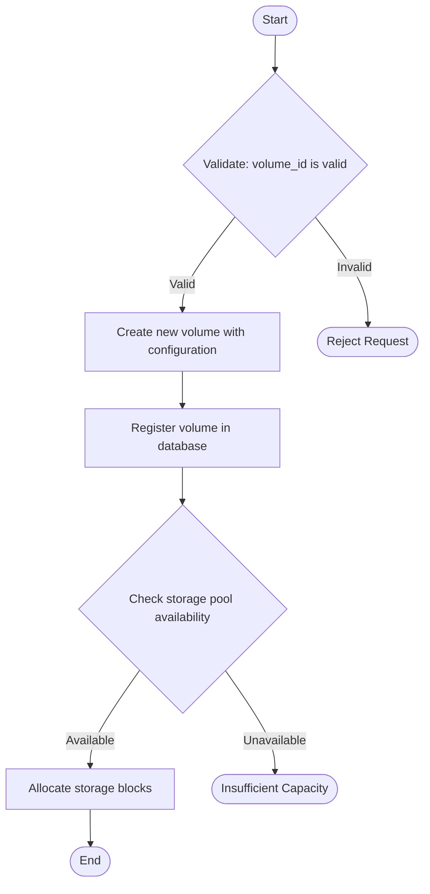

# Agent5 V4 Quick Start Guide

## What is V4?

Version 4 is a **complete architectural redesign** that implements a DocAgent-inspired bottom-up semantic aggregation pipeline. It provides significantly more accurate flowcharts for complex C++ projects.

### Key Improvements:

- ✅ **Clang AST + CFG Analysis**: More robust parsing than tree-sitter
- ✅ **Bottom-Up Understanding**: Semantic meaning built from leaf functions upward
- ✅ **Project-Wide Analysis**: True cross-file scenario tracking
- ✅ **LLM-Assisted Aggregation**: Uses LLM for summarization, not logic inference
- ✅ **Validated SFM**: Strict validation before flowchart generation
- ✅ **Enhanced Detail Levels**: Structurally different outputs at each level

## Prerequisites

```bash
# Ensure libclang is available
pip install -r requirements.txt

# Required: Ollama running with a code model
ollama pull qwen2.5-coder:7b
```

## V4 CLI Usage

### Basic V4 Flowchart

```bash
python -m agent5 flowchart \
    --use_v4 \
    --file /path/to/project/src/volume.cpp \
    --function CreateVolume \
    --project-path /path/to/project \
    --out volume_flowchart.mmd
```

### With Detail Level Control

```bash
# High-level business overview
python -m agent5 flowchart \
    --use_v4 \
    --file /path/to/project/src/volume.cpp \
    --function CreateVolume \
    --project-path /path/to/project \
    --detail-level high \
    --out volume_high.mmd

# Medium detail (default) - for documentation
python -m agent5 flowchart \
    --use_v4 \
    --file /path/to/project/src/volume.cpp \
    --function CreateVolume \
    --project-path /path/to/project \
    --detail-level medium \
    --out volume_medium.mmd

# Deep detail - for debugging/refactoring
python -m agent5 flowchart \
    --use_v4 \
    --file /path/to/project/src/volume.cpp \
    --function CreateVolume \
    --project-path /path/to/project \
    --detail-level deep \
    --out volume_deep.mmd
```

### With Debug Mode

```bash
python -m agent5 flowchart \
    --use_v4 \
    --file /path/to/project/src/volume.cpp \
    --function CreateVolume \
    --project-path /path/to/project \
    --detail-level medium \
    --debug \
    --out volume_debug.mmd
```

Debug mode saves intermediate artifacts to `{project_path}/debug/`:
- `ast_context.json`: AST metadata
- `function_summary.json`: Aggregated semantic summary
- `sfm.json`: Scenario Flow Model

### With Custom Include Paths

For projects with custom include directories:

```bash
python -m agent5 flowchart \
    --use_v4 \
    --file /path/to/project/src/volume.cpp \
    --function CreateVolume \
    --project-path /path/to/project \
    --include_paths "/usr/include,/opt/mylib/include,./external" \
    --out volume_flowchart.mmd
```

### Using Deterministic Translation (No LLM)

For environments without Ollama or for faster testing:

```bash
python -m agent5 flowchart \
    --use_v4 \
    --file /path/to/project/src/volume.cpp \
    --function CreateVolume \
    --project-path /path/to/project \
    --out volume_flowchart.mmd
# Note: --use_llm is False by default for Mermaid translation
# LLM is still used for semantic aggregation in Stage 3
```

## Parameter Reference

### Required Parameters

| Parameter | Description |
|-----------|-------------|
| `--use_v4` | Enable V4 pipeline (required for bottom-up analysis) |
| `--file` | Path to C++ file containing entry function (for disambiguation) |
| `--function` | Name of entry function (e.g., `CreateVolume`, `MyClass::Process`) |
| `--project-path` | Root path of C++ project (defines analysis scope) |
| `--out` | Output path for Mermaid file (`.mmd`) |

### Optional Parameters

| Parameter | Default | Description |
|-----------|---------|-------------|
| `--detail-level` | `medium` | Detail level: `high`, `medium`, `deep` |
| `--debug` | `False` | Save intermediate artifacts for inspection |
| `--include_paths` | None | Comma-separated include paths for Clang |
| `--use_llm` | `False` | Use LLM for Mermaid translation (Stage 6) |
| `--chat_model` | `qwen2.5-coder:7b` | Ollama model for LLM stages |
| `--ollama_base_url` | `http://localhost:11434` | Ollama server URL |

## Understanding the Output

### Mermaid Flowchart

The generated `.mmd` file contains a Mermaid flowchart:



### Debug Artifacts (if `--debug` enabled)

#### 1. `ast_context.json`

```json
{
  "functions": [
    "CreateVolume",
    "ValidateVolumeId",
    "CheckStoragePool",
    "AllocateStorage"
  ],
  "translation_units": [
    "/path/to/project/src/volume.cpp",
    "/path/to/project/src/storage.cpp"
  ],
  "call_graph_size": 12
}
```

#### 2. `function_summary.json`

```json
{
  "functionName": "CreateVolume",
  "purpose": "Create a new volume with specified configuration",
  "preconditions": [
    "volume_id must be valid",
    "user must have create_volume permission"
  ],
  "controlFlow": [
    "Check if volume already exists",
    "Validate storage pool availability"
  ],
  "stateChanges": [
    "Insert volume metadata into database",
    "Allocate storage blocks"
  ],
  "errorConditions": [
    "Throw VolumeAlreadyExistsException if duplicate",
    "Throw InsufficientCapacityException if pool full"
  ],
  "dependencies": ["ValidateVolumeId", "CheckStoragePool"]
}
```

#### 3. `sfm.json`

Complete Scenario Flow Model with nodes, edges, and detail-level annotations.

## Detail Level Guide

### HIGH: Business Overview

**Use Case**: Executive presentations, architecture documentation

**Includes**:
- Main business operation
- Start and End nodes

**Excludes**:
- Validations
- Decisions
- State changes
- Sub-operations

**Example**:
```
Start → Create Volume → End
```

### MEDIUM: Documentation (Default)

**Use Case**: Developer documentation, code reviews

**Includes**:
- All validations (with failure paths)
- All decision points
- All state-changing operations

**Excludes**:
- Function call expansions (shown as single step)
- Logging, metrics, debugging
- Utility helpers

**Example**:
```
Start → Validate volume_id → Check permissions → Create Volume → 
Register in DB → Allocate Storage → End
```

### DEEP: Implementation Details

**Use Case**: Debugging, refactoring, deep-dive analysis

**Includes**:
- Everything in MEDIUM
- Critical sub-operations (lookups, reads, loads)
- Function dependencies (as semantic steps)

**Excludes**:
- Logging, metrics
- Trivial wrappers

**Example**:
```
Start → Validate volume_id → Check permissions → 
Lookup existing volume → Check storage pool capacity → 
Create Volume → Insert metadata → Allocate blocks → 
Update pool stats → End
```

## Common Issues

### Issue: "Cannot find entry function"

**Solution**: Make sure the function name is correct. You can use:
- Simple name: `CreateVolume`
- Qualified name: `storage::VolumeManager::CreateVolume`

### Issue: "Parse errors in X files"

**Solution**: Add include paths using `--include_paths`:
```bash
--include_paths "/usr/include,/usr/local/include,./third_party"
```

### Issue: "Ollama connection refused"

**Solution**: Ensure Ollama is running:
```bash
ollama serve
```

### Issue: Flowchart too simple (missing details)

**Solution**: Use `--detail-level deep` for more granular flowcharts.

### Issue: Flowchart too complex (too many details)

**Solution**: Use `--detail-level high` for high-level overview.

## Comparison: V3 vs V4

| Feature | V3 (Tree-sitter) | V4 (DocAgent) |
|---------|------------------|---------------|
| **Parser** | Tree-sitter | Clang AST + CFG |
| **Understanding** | Top-down | Bottom-up |
| **Cross-file** | Limited | Full project |
| **LLM Usage** | Throughout | Stages 3 & 6 only |
| **Accuracy** | Moderate | High |
| **Detail Control** | Post-filtering | Built into SFM |
| **Function Calls** | Expanded | Summarized |

## Next Steps

1. **Read the Architecture**: [V4_ARCHITECTURE.md](V4_ARCHITECTURE.md)
2. **Try the Examples**: See `examples/` directory
3. **Explore Debug Mode**: Use `--debug` to understand the pipeline
4. **Experiment with Detail Levels**: Try `high`, `medium`, `deep` on your code

## Support

For issues or questions:
- GitHub Issues: [https://github.com/yourusername/Agent5/issues](https://github.com/yourusername/Agent5/issues)
- Documentation: `V4_ARCHITECTURE.md`, `README.md`, `FLOWCHART_GENERATION_FLOW.md`

---

**V4 brings documentation-grade flowcharts to C++ projects.**

**Understanding flows bottom-up. Visualization remains scenario-based.**
