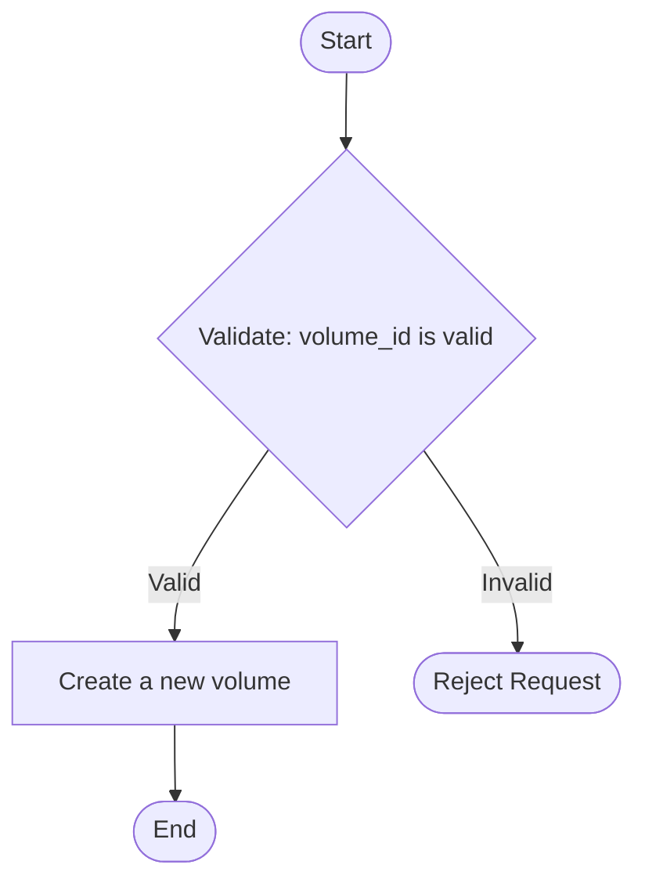

# Agent5 V4: DocAgent-Inspired Bottom-Up Architecture

## Overview

Version 4 introduces a **DocAgent-inspired bottom-up semantic aggregation pipeline** for generating documentation-quality C++ flowcharts. This is a fundamental architectural shift from the previous tree-sitter based approach.

## Core Philosophy

### Understanding vs. Visualization

The key insight is to **separate understanding from visualization**:

- **Understanding flows bottom-up** (leaf functions → entry function)
- **Visualization remains scenario-based** (high-level, never function-call diagrams)

This distinction is critical for producing accurate, documentation-grade flowcharts.

## Pipeline Architecture

### 6-Stage Pipeline

```
C++ Project
    ↓
[Stage 1] Full AST Construction (Clang)
    ↓
[Stage 2] Leaf-Level Semantic Extraction
    ↓
[Stage 3] Bottom-Up Backtracking & Aggregation (LLM-Assisted)
    ↓
[Stage 4] Scenario Flow Model Construction
    ↓
[Stage 5] Detail-Level Filtering (high/medium/deep)
    ↓
[Stage 6] Mermaid Translation (LLM Strict Translator)
    ↓
Mermaid Flowchart
```

---

## Stage 1: Full AST Construction

**Module:** `clang_ast_extractor.py`

**Purpose:** Parse the entire C++ project using libclang to extract comprehensive structural information.

**NO LLM at this stage.**

### Extracts:

1. **Abstract Syntax Tree (AST)** for all translation units
2. **Control Flow Graphs (CFG)** per function
   - Basic blocks
   - Predecessors/successors
   - Entry/exit blocks
3. **Call relationships**
   - Caller → Callee mapping
   - Call sites with context
4. **Leaf-level execution units**
   - Guard conditions
   - State mutations
   - Error exits

### Key Classes:

- `ProjectAST`: Complete AST representation
- `ControlFlowGraph`: CFG per function
- `BasicBlock`: Single-entry, single-exit code blocks
- `CallRelationship`: Caller-callee relationships

### Example:

```python
from agent5.clang_ast_extractor import extract_ast_for_project

project_ast = extract_ast_for_project(
    project_path=Path("/path/to/project"),
    include_paths=[Path("/usr/include")]
)

print(f"Functions: {len(project_ast.functions)}")
print(f"Call relationships: {len(project_ast.call_graph)}")
```

---

## Stage 2: Leaf-Level Semantic Extraction

**Module:** `leaf_semantic_extractor.py`

**Purpose:** Identify atomic semantic actions at the deepest AST/CFG level.

**NO LLM at this stage - purely rule-based.**

### Atomic Semantic Actions:

1. **Validation** - Checking validity of inputs/state
2. **Permission Check** - Authorization checks
3. **State Mutation** - Modifying persistent state
4. **Side Effect** - Irreversible operations
5. **Early Exit** - Return/throw statements
6. **Guard Condition** - Control flow decisions
7. **Error Handling** - Exception handling
8. **Resource Acquisition/Release** - RAII operations
9. **Data Transformation** - Data processing

### Output:

Each basic block produces a `BlockSemantics` with a list of `SemanticAction` objects:

```json
{
  "type": "validation",
  "effect": "reject request if volume_id is invalid",
  "controlImpact": true,
  "stateImpact": false,
  "location": "volume.cpp:42",
  "metadata": {"condition": "!IsValidVolumeId(volume_id)"}
}
```

### Key Classes:

- `SemanticAction`: Atomic semantic action
- `BlockSemantics`: Semantics for a basic block
- `LeafSemanticExtractor`: Rule-based extractor

### Example:

```python
from agent5.leaf_semantic_extractor import extract_leaf_semantics

leaf_semantics = extract_leaf_semantics(project_ast)

for func_name, block_semantics in leaf_semantics.items():
    print(f"{func_name}: {len(block_semantics)} blocks")
```

---

## Stage 3: Bottom-Up Backtracking & Aggregation

**Module:** `bottom_up_aggregator.py`

**Purpose:** Build semantic understanding from leaf functions upward using LLM-assisted summarization.

**LLM INVOLVED - but strictly based on AST facts.**

### Process:

1. **Start from leaf functions** (functions that don't call other project functions)
2. **Generate local semantic summaries** using LLM:
   - Input: Extracted semantic actions (from Stage 2)
   - Output: `FunctionSummary` with purpose, preconditions, control flow, state changes
3. **Move upward in call graph**:
   - Combine child function summaries
   - Elide non-critical operations (logging, metrics, trivial helpers)
   - Preserve control-flow and state semantics
4. **Continue backtracking** until reaching the entry function

### Rules:

- ❌ Function calls are **summarized**, not expanded
- ❌ Aggregation is **semantic**, not structural
- ❌ No new logic introduced by LLM
- ✅ LLM uses ONLY provided AST facts

### Output:

A `FunctionSummary` for the entry function:

```json
{
  "functionName": "CreateVolume",
  "purpose": "Create a new volume with specified configuration",
  "preconditions": [
    "volume_id must be valid",
    "user must have create_volume permission",
    "storage pool must have sufficient capacity"
  ],
  "postconditions": [
    "volume is registered in volume table",
    "storage is allocated",
    "audit log is updated"
  ],
  "controlFlow": [
    "Check if volume already exists",
    "Validate storage pool availability",
    "Choose allocation strategy based on volume type"
  ],
  "stateChanges": [
    "Insert volume metadata into database",
    "Allocate storage blocks",
    "Update pool capacity"
  ],
  "errorConditions": [
    "Throw VolumeAlreadyExistsException if duplicate",
    "Throw InsufficientCapacityException if pool full",
    "Throw PermissionDeniedException if unauthorized"
  ],
  "dependencies": ["ValidateVolumeId", "CheckPermission", "AllocateStorage"]
}
```

### Key Classes:

- `FunctionSummary`: Semantic summary of a function
- `BottomUpAggregator`: Orchestrates the aggregation process

### LLM Prompts:

#### Leaf Function Prompt:
Instructs LLM to summarize based ONLY on extracted actions.

#### Aggregation Prompt:
Instructs LLM to combine child summaries and elide non-critical operations.

### Example:

```python
from agent5.bottom_up_aggregator import aggregate_semantics

summary = aggregate_semantics(
    project_ast=project_ast,
    leaf_semantics=leaf_semantics,
    entry_function="CreateVolume",
    llm_model="qwen2.5-coder:7b"
)

print(summary.purpose)
print(f"Preconditions: {len(summary.preconditions)}")
```

---

## Stage 4: Scenario Flow Model Construction

**Module:** `sfm_builder.py`

**Purpose:** Convert aggregated semantic summaries into a deterministic Scenario Flow Model (SFM).

**NO LLM - deterministic conversion.**

### Scenario Flow Model (SFM):

The SFM is a **directed graph** representing the scenario flow with explicit detail-level annotations.

**SFM is the SINGLE SOURCE OF TRUTH for flowchart generation.**

### Node Types:

1. **Terminator** - Start/End nodes
2. **Process** - Action/operation
3. **Decision** - Conditional branch
4. **IO** - Input/output operation

### Detail Levels:

Each node and edge is tagged with the detail levels in which it should appear:

- **HIGH**: Business-level steps only
- **MEDIUM**: All decisions + validations + state changes (default)
- **DEEP**: Expanded critical sub-operations

### Structure:

```json
{
  "entryFunction": "CreateVolume",
  "nodes": {
    "node1": {
      "id": "node1",
      "type": "terminator",
      "label": "Start",
      "detailLevels": ["high", "medium", "deep"]
    },
    "node2": {
      "id": "node2",
      "type": "decision",
      "label": "Validate: volume_id is valid",
      "detailLevels": ["medium", "deep"]
    },
    "node3": {
      "id": "node3",
      "type": "process",
      "label": "Create a new volume",
      "detailLevels": ["high", "medium", "deep"]
    }
  },
  "edges": [
    {
      "from": "node1",
      "to": "node2",
      "detailLevels": ["medium", "deep"]
    },
    {
      "from": "node2",
      "to": "node3",
      "label": "Valid",
      "detailLevels": ["medium", "deep"]
    }
  ],
  "startNode": "node1",
  "endNodes": ["nodeN"]
}
```

### Validation:

Before proceeding, the SFM is validated:
- Exactly 1 start node
- At least 1 end node
- All edges reference valid nodes
- All nodes have at least one detail level

**If validation fails, the pipeline MUST NOT proceed.**

### Key Classes:

- `ScenarioFlowModel`: The SFM graph
- `SFMNode`: A node in the graph
- `SFMEdge`: An edge in the graph
- `SFMBuilder`: Converts `FunctionSummary` → `SFM`

### Example:

```python
from agent5.sfm_builder import build_scenario_flow_model

sfm = build_scenario_flow_model(summary)

is_valid, errors = sfm.validate()
if not is_valid:
    raise ValueError(f"Invalid SFM: {errors}")
```

---

## Stage 5: Detail-Level Filtering

**Module:** `sfm_builder.py` (method: `filter_by_detail_level`)

**Purpose:** Filter the SFM to include only nodes/edges for the specified detail level.

**NO LLM - deterministic filtering.**

### Detail Level Rules:

#### HIGH (Business Overview)
- **Include:**
  - Major business operations
  - High-level purpose
- **Exclude:**
  - Validations
  - Internal decisions
  - State change details
  - Sub-operations

**Use Case:** Architecture documentation, executive overviews

#### MEDIUM (Default Documentation)
- **Include:**
  - All validations
  - All decision points
  - All state-changing operations
- **Exclude:**
  - Internal sub-operations
  - Called function expansions (show as single step)
- **DO NOT expand:**
  - Logging, metrics, debugging
  - Utility helpers
  - Memory allocation wrappers

**Use Case:** Developer documentation, code reviews

#### DEEP (Implementation Details)
- **Include:**
  - Everything in MEDIUM
  - Critical sub-operations that:
    - Change control flow
    - Modify persistent state
    - Enforce constraints
  - Internal validation steps
  - Function call expansions (as single semantic steps)
- **Exclude:**
  - Logging, metrics, debugging
  - Trivial wrappers
  - Serialization helpers

**Use Case:** Deep-dive analysis, debugging, refactoring

### Example:

```python
# Filter for HIGH level
high_sfm = sfm.filter_by_detail_level(DetailLevel.HIGH)

# Filter for DEEP level
deep_sfm = sfm.filter_by_detail_level(DetailLevel.DEEP)
```

---

## Stage 6: Mermaid Translation

**Module:** `mermaid_translator.py`

**Purpose:** Translate SFM to Mermaid flowchart syntax.

**LLM AS STRICT TRANSLATOR ONLY - no logic changes.**

### Rules:

- ❌ NO logic changes
- ❌ NO depth changes
- ❌ NO inference
- ✅ Input: Filtered SFM
- ✅ Output: Mermaid syntax ONLY

### Translation Modes:

1. **LLM Translation** (default): Use LLM for natural phrasing
2. **Deterministic Translation** (fallback): Direct SFM → Mermaid mapping

### LLM Prompt:

Instructs LLM to:
- Use appropriate Mermaid node shapes
- Keep labels concise
- Match SFM structure exactly
- Return ONLY Mermaid code

### Example Output:



### Key Classes:

- `MermaidTranslator`: Translates SFM to Mermaid

### Example:

```python
from agent5.mermaid_translator import translate_to_mermaid

mermaid_code = translate_to_mermaid(
    sfm=filtered_sfm,
    llm_model="qwen2.5-coder:7b",
    use_llm=True
)
```

---

## Complete Pipeline Orchestration

**Module:** `docagent_pipeline.py`

**Purpose:** Orchestrate all 6 stages into a cohesive pipeline.

### Example Usage:

```python
from pathlib import Path
from agent5.docagent_pipeline import generate_flowchart

mermaid_code = generate_flowchart(
    project_path=Path("/path/to/cpp/project"),
    entry_function="CreateVolume",
    entry_file=Path("/path/to/cpp/project/volume.cpp"),  # Optional
    detail_level="medium",
    llm_model="qwen2.5-coder:7b",
    use_llm_translation=True
)

print(mermaid_code)
```

### CLI Usage:

```bash
# V4 Pipeline with high-level detail
python -m agent5 flowchart \
    --use_v4 \
    --file /path/to/project/volume.cpp \
    --function CreateVolume \
    --project-path /path/to/project \
    --detail-level high \
    --out volume_flow.mmd

# V4 Pipeline with deep detail and debug mode
python -m agent5 flowchart \
    --use_v4 \
    --file /path/to/project/volume.cpp \
    --function CreateVolume \
    --project-path /path/to/project \
    --detail-level deep \
    --debug \
    --include_paths "/usr/include,/opt/include" \
    --out volume_deep.mmd
```

---

## Key Differences from V3

| Aspect | V3 (Tree-sitter) | V4 (DocAgent-inspired) |
|--------|------------------|------------------------|
| **Parsing** | Tree-sitter | Clang AST + CFG |
| **Understanding** | Top-down | Bottom-up |
| **Semantic Extraction** | Limited | Comprehensive (9 action types) |
| **LLM Usage** | Throughout pipeline | Stages 3 & 6 only |
| **Function Calls** | Expanded into diagram | Summarized semantically |
| **Accuracy** | Moderate | High (AST-grounded) |
| **Scalability** | Limited (single-file focus) | Project-wide |
| **Detail Control** | Post-hoc filtering | Built into SFM from Stage 4 |

---

## Critical Constraints

### ❌ Never Generate Function-Call Diagrams

Function calls are **summarized as semantic actions**, not expanded into call graphs.

### ❌ Never Let LLM Infer Logic

LLM operates ONLY on extracted AST facts. No guessing.

### ❌ Never Expand Noise Operations

Logging, metrics, utility helpers are **always elided**.

### ✅ Always Bottom-Up Understanding

Leaf functions → Entry function.

### ✅ Always Scenario-Based Visualization

Diagrams show scenario flow, not implementation.

### ✅ Always Validate SFM

If SFM is invalid, **FAIL FAST**. Do not proceed to Mermaid generation.

---

## Dependencies

```
libclang==18.1.1      # Clang AST parsing
langchain-ollama      # LLM integration
langchain-core        # LLM prompts
```

---

## Future Enhancements

1. **Inter-procedural CFG**: Inline critical functions into CFG
2. **Symbolic Execution**: Track state changes more precisely
3. **Code Clone Detection**: Identify redundant validation/error handling
4. **Multi-entry Scenarios**: Support scenarios spanning multiple entry points
5. **Incremental Analysis**: Cache AST/semantics for faster re-runs

---

## References

- **DocAgent**: [https://github.com/facebookresearch/DocAgent](https://github.com/facebookresearch/DocAgent)
- **Clang AST**: [https://clang.llvm.org/docs/IntroductionToTheClangAST.html](https://clang.llvm.org/docs/IntroductionToTheClangAST.html)
- **Control Flow Graphs**: [https://en.wikipedia.org/wiki/Control-flow_graph](https://en.wikipedia.org/wiki/Control-flow_graph)

---

## Questions & Support

For issues or questions about the V4 pipeline, please refer to:
- `QUICKSTART.md` for basic usage
- `README.md` for installation and configuration
- `FLOWCHART_GENERATION_FLOW.md` for internal execution flow

---

**Version 4 is a complete reimagining of C++ flowchart generation.**

**Understanding flows bottom-up. Visualization remains scenario-based.**

This is the way.


