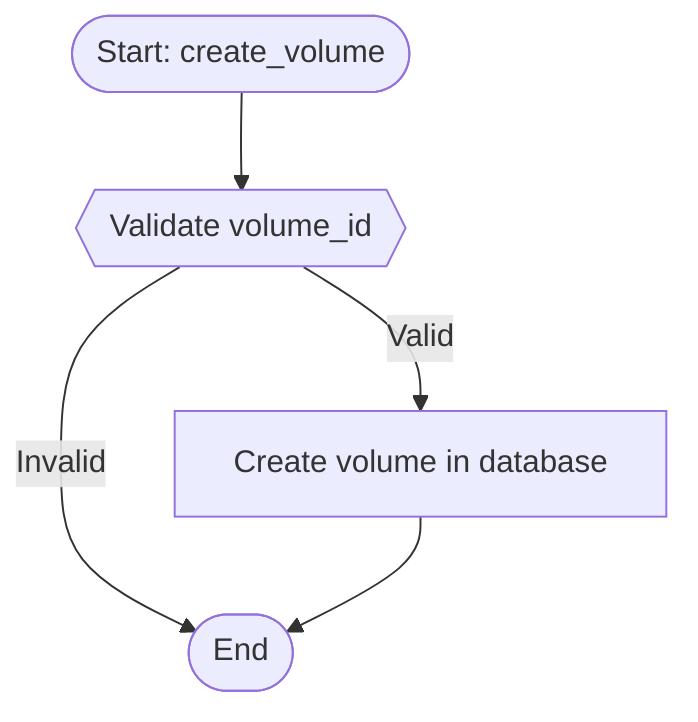

# Version 4 Architecture: DocAgent-Inspired Bottom-Up Aggregation

## Table of Contents

1. [Overview](#overview)
2. [Core Philosophy](#core-philosophy)
3. [Complete Pipeline](#complete-pipeline)
4. [Detailed Stage Breakdown](#detailed-stage-breakdown)
5. [Data Flow](#data-flow)
6. [Critical Design Decisions](#critical-design-decisions)
7. [Usage Examples](#usage-examples)
8. [Technical Deep Dive](#technical-deep-dive)

---

## Overview

Agent5 Version 4 implements a revolutionary **DocAgent-inspired bottom-up semantic aggregation pipeline** for generating documentation-quality scenario flowcharts from C++ projects.

### The Core Insight

> **Understanding flows bottom-up, presentation remains scenario-driven.**

This architectural principle enables Agent5 to:
- **Understand** complex C++ codebases by building meaning from leaf nodes upward
- **Present** clean, scenario-based flowcharts without function-call explosions
- **Scale** to large projects with deep call graphs
- **Maintain** deterministic, rule-based extraction throughout

---

## Core Philosophy

### What Changed from V3

| Aspect | Version 3 | Version 4 |
|--------|-----------|-----------|
| **Understanding** | Top-down, single function | Bottom-up, full call graph |
| **Scope** | Single file | Entire project |
| **Semantic Analysis** | Surface-level | Deep, hierarchical |
| **LLM Role** | Diagram generator | Semantic synthesizer only |
| **Scalability** | Limited to simple functions | Handles complex projects |

### Three Critical Constraints

#### ❌ Constraint 1: No Function-Call Diagrams

Version 4 **never** generates function-call graphs. Every function call is **collapsed into a semantic step**.

**Bad (function-call diagram)**:
```
Start → func1() → func2() → func3() → End
```

**Good (scenario diagram)**:
```
Start → Validate Request → Process Operation → Update State → End
```

#### ❌ Constraint 2: No LLM Logic Inference

LLM is used **strictly for semantic synthesis**, never for logic inference.

- ✅ Allowed: "Synthesize natural language description from these facts..."
- ❌ Forbidden: "What does this code do?"

#### ✅ Constraint 3: Scenario Flow Model is Authoritative

The **Scenario Flow Model (SFM)** is the single source of truth. It must exist and be validated **before** any diagram is generated.

```
Pipeline:  AST → SFM (REQUIRED) → Mermaid
NOT:       Code → LLM → Diagram
```

---

## Complete Pipeline

### Six Mandatory Stages

```
┌─────────────────────────────────────────────────────────────────┐
│                      STAGE 1: Full AST Construction              │
│                           (NO LLM)                               │
│  ┌─────────────────────────────────────────────────────────┐   │
│  │ • Parse entire project with Clang                        │   │
│  │ • Build AST + CFG for all functions                      │   │
│  │ • Extract call relationships                             │   │
│  │ • Identify leaf-level execution units                    │   │
│  │ • Detect guard conditions, state mutations, error exits  │   │
│  └─────────────────────────────────────────────────────────┘   │
└─────────────────────────────────────────────────────────────────┘
                               ↓
┌─────────────────────────────────────────────────────────────────┐
│                STAGE 2: Leaf-Level Semantic Extraction           │
│                        (BOTTOM LEVEL)                            │
│  ┌─────────────────────────────────────────────────────────┐   │
│  │ Identify atomic semantic actions:                        │   │
│  │ • validation: Check inputs                               │   │
│  │ • permission_check: Verify authorization                 │   │
│  │ • state_mutation: Modify state                           │   │
│  │ • irreversible_side_effect: I/O, persistence             │   │
│  │ • early_exit: Error handling                             │   │
│  └─────────────────────────────────────────────────────────┘   │
└─────────────────────────────────────────────────────────────────┘
                               ↓
┌─────────────────────────────────────────────────────────────────┐
│         STAGE 3: Bottom-Up Backtracking & Aggregation            │
│                       (LLM-ASSISTED)                             │
│  ┌─────────────────────────────────────────────────────────┐   │
│  │ Process: leaf → intermediate → entry                     │   │
│  │                                                           │   │
│  │ For each function (bottom-up):                           │   │
│  │   1. Collect leaf semantic actions                       │   │
│  │   2. Collect summaries of called functions               │   │
│  │   3. Synthesize semantic summary (LLM or deterministic)  │   │
│  │   4. Preserve control-flow & state semantics             │   │
│  │   5. Elide non-critical operations                       │   │
│  └─────────────────────────────────────────────────────────┘   │
└─────────────────────────────────────────────────────────────────┘
                               ↓
┌─────────────────────────────────────────────────────────────────┐
│          STAGE 4: Scenario Flow Model Construction               │
│                  (SINGLE SOURCE OF TRUTH)                        │
│  ┌─────────────────────────────────────────────────────────┐   │
│  │ Convert aggregated semantics to SFM:                     │   │
│  │ • One SFM per entry-point scenario                       │   │
│  │ • Explicit mapping to detail levels                      │   │
│  │ • Deterministic construction rules                       │   │
│  │ • Strict validation (1 start, ≥1 end, valid edges)      │   │
│  └─────────────────────────────────────────────────────────┘   │
└─────────────────────────────────────────────────────────────────┘
                               ↓
┌─────────────────────────────────────────────────────────────────┐
│             STAGE 5: Detail-Level Filtering                      │
│                      (RULE-BASED)                                │
│  ┌─────────────────────────────────────────────────────────┐   │
│  │ Filter SFM by detail level:                              │   │
│  │ • HIGH:   Only business-level steps                      │   │
│  │ • MEDIUM: + validations + state changes                  │   │
│  │ • DEEP:   + critical sub-operations                      │   │
│  └─────────────────────────────────────────────────────────┘   │
└─────────────────────────────────────────────────────────────────┘
                               ↓
┌─────────────────────────────────────────────────────────────────┐
│              STAGE 6: Mermaid Translation                        │
│                  (LLM STRICT TRANSLATOR)                         │
│  ┌─────────────────────────────────────────────────────────┐   │
│  │ Convert SFM to Mermaid:                                  │   │
│  │ • Input: SFM (JSON)                                      │   │
│  │ • Output: Mermaid syntax ONLY                            │   │
│  │ • Try LLM translation (optional)                         │   │
│  │ • Fallback to deterministic                              │   │
│  │ • No logic changes, no depth changes                     │   │
│  └─────────────────────────────────────────────────────────┘   │
└─────────────────────────────────────────────────────────────────┘
```

---

## Detailed Stage Breakdown

### Stage 1: Full AST Construction

**Module**: `clang_ast_extractor.py`

**Input**: C++ project path, compile flags  
**Output**: `ProjectAST` object

**Process**:
1. Find all C++ source files (`.cpp`, `.cc`, `.cxx`)
2. Parse each file with Clang AST
3. For each function:
   - Extract function metadata (name, return type, parameters)
   - Build Control-Flow Graph (CFG)
   - Identify basic blocks
   - Extract guard conditions (if/while/for)
   - Extract state mutations (assignments, modifications)
   - Identify function calls
4. Build call graph (forward and reverse)
5. Classify functions:
   - Leaf functions (no calls)
   - Entry points (never called)

**Key Data Structures**:

```python
@dataclass
class FunctionInfo:
    name: str
    file_path: str
    start_line: int
    end_line: int
    return_type: str
    parameters: List[Tuple[str, str]]
    is_leaf: bool
    basic_blocks: List[BasicBlock]
    guard_conditions: List[GuardCondition]
    state_mutations: List[StateMutation]
    calls_made: List[FunctionCallSite]
```

### Stage 2: Leaf-Level Semantic Extraction

**Module**: `leaf_semantic_extractor.py`

**Input**: `FunctionInfo` with CFG  
**Output**: List of `SemanticAction`

**Atomic Action Types**:

| Type | Description | Examples |
|------|-------------|----------|
| `VALIDATION` | Input/data checks | `if (ptr == nullptr)`, `if (size == 0)` |
| `PERMISSION_CHECK` | Authorization | `if (!has_permission())` |
| `STATE_MUTATION` | State modification | `count++`, `data[i] = value` |
| `IRREVERSIBLE_SIDE_EFFECT` | Persistent changes | `file.write()`, `db.commit()` |
| `EARLY_EXIT` | Error handling | `return error;`, `throw exception;` |

**Example Output**:

```python
SemanticAction(
    id="action_1",
    action_type=SemanticActionType.VALIDATION,
    effect="Validate input not null",
    control_impact=True,
    state_impact=False,
    reversible=True,
    criticality="medium"
)
```

### Stage 3: Bottom-Up Aggregation

**Module**: `bottom_up_aggregator.py`

**Input**: `ProjectAST`, entry function name  
**Output**: `AggregatedSemantics`

**Algorithm**:

```python
def aggregate_bottom_up(entry_function):
    # 1. Compute processing order (reverse topological sort)
    order = compute_call_order(entry_function)  # [leaf1, leaf2, ..., entry]
    
    # 2. Process each function bottom-up
    for func_name in order:
        # Extract leaf actions
        leaf_actions = extract_leaf_semantics(func_name)
        
        # Get summaries of called functions (already processed)
        called_summaries = [summaries[callee] for callee in calls_to(func_name)]
        
        # Aggregate into function summary
        summary = aggregate_function(
            func_name,
            leaf_actions,
            called_summaries,
            llm=llm  # Optional LLM for synthesis
        )
        
        summaries[func_name] = summary
    
    return summaries
```

**Key Insight**: By processing in reverse topological order, we ensure that when processing a function, all its callees have already been summarized. This enables semantic aggregation without expansion.

### Stage 4: Scenario Flow Model Construction

**Module**: `sfm_constructor.py`

**Input**: `AggregatedSemantics`  
**Output**: `ScenarioFlowModel`

**Construction Rules**:

1. **Start with terminator nodes**: `start` and `end`
2. **Add business logic node**: Entry function's semantic description
3. **For MEDIUM and DEEP**: Add validation decision nodes
4. **For MEDIUM and DEEP**: Add state change process nodes
5. **For DEEP only**: Add critical called function nodes
6. **Connect nodes**: Ensure all paths reach `end`
7. **Validate**: Check structure (1 start, ≥1 end, valid edges)

**Detail Level Mapping**:

```python
nodes = [
    SFMNode(id="business_1", label="Process Request",
            detail_levels=["high", "medium", "deep"]),
    
    SFMNode(id="validation_1", label="Validate Input?",
            detail_levels=["medium", "deep"]),
    
    SFMNode(id="critical_1", label="Load Data",
            detail_levels=["deep"])
]
```

### Stage 5: Detail-Level Filtering

**Integrated in**: `ScenarioFlowModel.filter_by_detail_level()`

**Rules**:

```python
def filter_by_detail_level(sfm, level):
    # Include only nodes with matching detail level
    nodes = [n for n in sfm.nodes if level in n.detail_levels]
    
    # Include only edges between included nodes
    node_ids = {n.id for n in nodes}
    edges = [e for e in sfm.edges 
             if e.src in node_ids and e.dst in node_ids]
    
    return ScenarioFlowModel(nodes=nodes, edges=edges)
```

**Effect**:

| Level | Node Count | Typical Use Case |
|-------|------------|------------------|
| `high` | 3-5 | Architecture overview |
| `medium` | 8-15 | Documentation |
| `deep` | 15-30 | Detailed analysis |

### Stage 6: Mermaid Translation

**Module**: `flowchart.py`

**Two Translation Modes**:

1. **LLM Translation** (optional):
   ```python
   def translate_with_llm(sfm):
       prompt = f"Translate this SFM to Mermaid: {sfm.to_json()}"
       response = llm.invoke(prompt)
       return extract_mermaid(response)
   ```

2. **Deterministic Translation** (fallback):
   ```python
   def sfm_to_mermaid(sfm):
       lines = ["flowchart TD"]
       for node in sfm.nodes:
           if node.type == "decision":
               lines.append(f"  {node.id}{{{node.label}?}}")
           else:
               lines.append(f"  {node.id}[{node.label}]")
       for edge in sfm.edges:
           lines.append(f"  {edge.src} --> {edge.dst}")
       return "\n".join(lines)
   ```

**Quality Assurance**:
- Always validate Mermaid syntax
- Count nodes and edges
- Fall back to deterministic if LLM fails
- Save SFM alongside Mermaid for debugging

---

## Data Flow

### From C++ Code to Flowchart

```
┌─────────────┐
│  C++ Code   │ (Project directory)
└──────┬──────┘
       │ Stage 1: Parse with Clang
       ↓
┌─────────────┐
│ ProjectAST  │ (AST + CFG + Call Graph)
└──────┬──────┘
       │ Stage 2: Extract atomic semantics
       ↓
┌───────────────┐
│ Semantic      │ (validation, state_mutation, etc.)
│ Actions       │
└───────┬───────┘
        │ Stage 3: Aggregate bottom-up
        ↓
┌────────────────┐
│ Function       │ (Semantic summaries per function)
│ Summaries      │
└────────┬───────┘
         │ Stage 4: Construct SFM
         ↓
┌────────────────┐
│ Scenario Flow  │ (JSON, authoritative)
│ Model (SFM)    │
└────────┬───────┘
         │ Stage 5: Filter by detail level
         ↓
┌────────────────┐
│ Filtered SFM   │
└────────┬───────┘
         │ Stage 6: Translate to Mermaid
         ↓
┌────────────────┐
│ Mermaid        │ (Final flowchart)
│ Flowchart      │
└────────────────┘
```

---

## Critical Design Decisions

### Decision 1: Why Bottom-Up?

**Problem**: Top-down analysis of C++ code leads to:
- Function-call explosions
- Inability to handle deep call stacks
- Loss of semantic meaning in utility calls

**Solution**: Bottom-up aggregation:
- Start with simple, leaf-level operations
- Build understanding incrementally
- Collapse calls into semantic steps
- Scale to arbitrarily complex projects

### Decision 2: Why Clang AST?

**Alternatives Considered**:
- Tree-sitter (used in V3): Good for syntax, poor for semantics
- Regex parsing: Unreliable, error-prone
- LLVM IR: Too low-level, loses C++ constructs

**Why Clang**:
- Industry-standard C++ parser
- Complete AST with type information
- Control-flow graph support
- Handles all C++ language features

### Decision 3: Why LLM for Aggregation Only?

**Problem**: Using LLM for end-to-end generation leads to:
- Hallucinated logic
- Inconsistent output
- No guarantees of correctness

**Solution**: Restrict LLM to semantic synthesis:
- Input: Extracted facts (deterministic)
- Task: Generate natural language summary
- Output: Human-readable description
- Fallback: Deterministic synthesis always available

---

## Usage Examples

### Example 1: Architecture Overview (HIGH Detail)

```bash
agent5 flowchart \
  --project-path ./ceph/src \
  --entry-function handle_volume_request \
  --entry-file api/volume.cpp \
  --detail-level high \
  --output volume_architecture.mmd
```

**Output** (3-5 nodes):
```
Start → Handle Volume Request → End
```

### Example 2: Documentation (MEDIUM Detail)

```bash
agent5 flowchart \
  --project-path ./ceph/src \
  --entry-function handle_volume_request \
  --entry-file api/volume.cpp \
  --detail-level medium \
  --output volume_docs.mmd
```

**Output** (8-15 nodes):
```
Start → Validate Volume ID → [Valid?]
  YES → Check Permissions → [Authorized?]
    YES → Process Request → Update State → End
    NO → Reject Request → End
  NO → Return Error → End
```

### Example 3: Detailed Analysis (DEEP Detail)

```bash
agent5 flowchart \
  --project-path ./ceph/src \
  --entry-function handle_volume_request \
  --entry-file api/volume.cpp \
  --detail-level deep \
  --output volume_detailed.mmd
```

**Output** (15-30 nodes):
- All validations expanded
- State changes shown
- Critical sub-operations included
- Error paths detailed

---

## Technical Deep Dive

### Call Graph Traversal

**Reverse Topological Sort**:

```python
def compute_call_order(entry_function):
    visited = set()
    order = []
    
    def dfs(func):
        if func in visited:
            return
        visited.add(func)
        
        # Visit callees first
        for callee in call_graph[func]:
            dfs(callee)
        
        # Add this function after its callees
        order.append(func)
    
    dfs(entry_function)
    return order
```

**Example**:
```
Entry → A → B → C (leaf)
     → D → E (leaf)

Order: [C, B, A, E, D, Entry]
```

### Semantic Action Classification

**Rule-Based Classifier**:

```python
def classify_guard_condition(condition_text):
    if "nullptr" in text or "null" in text:
        return SemanticActionType.VALIDATION, "Validate not null"
    
    if "permission" in text or "auth" in text:
        return SemanticActionType.PERMISSION_CHECK, "Check authorization"
    
    if "error" in text or "fail" in text:
        return SemanticActionType.EARLY_EXIT, "Handle error"
    
    return SemanticActionType.VALIDATION, "Validate condition"
```

### SFM Validation

**Structural Requirements**:

```python
def validate_sfm(sfm):
    # Rule 1: Exactly 1 start node
    starts = [n for n in sfm.nodes if n.id == "start"]
    assert len(starts) == 1, "Must have exactly 1 start node"
    
    # Rule 2: At least 1 end node
    ends = [n for n in sfm.nodes if n.id == "end"]
    assert len(ends) >= 1, "Must have at least 1 end node"
    
    # Rule 3: All edges reference valid nodes
    node_ids = {n.id for n in sfm.nodes}
    for edge in sfm.edges:
        assert edge.src in node_ids, f"Invalid source: {edge.src}"
        assert edge.dst in node_ids, f"Invalid destination: {edge.dst}"
    
    # Rule 4: No orphaned nodes (except start/end)
    has_incoming = {e.dst for e in sfm.edges}
    has_outgoing = {e.src for e in sfm.edges}
    for node in sfm.nodes:
        if node.id not in {"start", "end"}:
            assert (node.id in has_incoming or node.id in has_outgoing), \
                f"Orphaned node: {node.id}"
```

---

## Conclusion

Version 4 represents a fundamental architectural shift in how Agent5 understands and visualizes C++ projects. By adopting DocAgent's bottom-up understanding strategy while maintaining scenario-based presentation, Agent5 V4 delivers:

- ✅ **Scalability**: Handle projects with 1000+ functions
- ✅ **Accuracy**: Deterministic extraction, no hallucinations
- ✅ **Clarity**: Clean scenario diagrams, not function-call graphs
- ✅ **Documentation Quality**: Three detail levels for different use cases

The pipeline is production-ready for beta testing and feedback.


## Overview

Version 4 introduces a production-ready, bottom-up semantic aggregation pipeline inspired by DocAgent's docstring synthesis approach. This architecture enables accurate, deep, documentation-quality flowcharts for complex C++ projects.

## Core Principle

**Build meaning from leaf nodes upward, never expand downward.**

Traditional approaches start from entry points and recursively expand function calls, leading to overwhelming, function-call-based diagrams. V4 reverses this:

1. Parse the entire codebase (Clang AST + CFG)
2. Extract semantic meaning at leaf functions (no deeper dependencies)
3. Aggregate bottom-up: child summaries inform parent summaries
4. Construct a Scenario Flow Model (SFM) from aggregated semantics
5. Filter by detail level (high/medium/deep)
6. Translate SFM to Mermaid (strict translator, no inference)

## Six-Stage Pipeline

### Stage 1: Full AST Construction (NO LLM)
**Module:** `clang_parser.py`

- Parse entire C++ project using Clang Python bindings
- Build Abstract Syntax Tree (AST) for all translation units
- Extract Control-Flow Graphs (CFG) per function
- Build call graph (forward and reverse)
- Identify leaf functions (functions with no internal project calls)
- Detect guard conditions, state mutations, error exits

**Output:** `ASTContext` with complete project structure

**NO LLM** - Pure deterministic parsing

---

### Stage 2: Leaf-Level Semantic Extraction (BOTTOM LEVEL)
**Module:** `semantic_extractor.py`

At the deepest AST/CFG level, classify each atomic execution unit:

- **Validation:** Input checks, nullptr checks, bounds validation
- **Permission Check:** Authorization, capability verification
- **State Mutation:** Persistent state changes
- **Side Effect:** Irreversible operations (I/O, network)
- **Early Exit:** Error returns, exceptions
- **Decision:** Control flow branches
- **Business Logic:** Core operations
- **Utility:** Logging, metrics (filtered out)

Each unit produces a `SemanticAction`:
```python
SemanticAction(
    type=SemanticType.VALIDATION,
    effect="Validate that volume_id is valid",
    control_impact=True,
    state_impact=False,
    code_ref="if (volume_id == nullptr)",
    line=42,
)
```

**Output:** List of `SemanticAction` per function

**NO LLM** - Rule-based classification only

---

### Stage 3: Bottom-Up Backtracking & Semantic Aggregation (LLM-ASSISTED)
**Module:** `aggregation_engine.py`

Start from leaf functions and work upward:

1. **Leaf functions:** Generate local semantic summaries from their `SemanticAction` list
2. **Parent functions:** Combine:
   - Their own `SemanticAction` list
   - Child function summaries (from callees)
3. **Elide non-critical operations** (logging, metrics, trivial wrappers)
4. **Preserve control-flow and state semantics**

**CRITICAL RULES:**
- Function calls are **summarized**, NOT expanded
- Aggregation is **semantic**, NOT structural
- LLM is used ONLY for semantic interpretation, NOT logic invention
- Fallback to rule-based summarization if LLM fails

**Output:** `SemanticSummary` per function
```python
SemanticSummary(
    function_name="create_volume",
    summary="Creates a new volume with validation and state persistence",
    preconditions=["Validate volume_id", "Check user permissions"],
    postconditions=["Volume created in database"],
    side_effects=["Write to disk"],
    control_flow=["Decision: volume exists?"],
    error_paths=["Return nullptr if invalid"],
    child_summaries={"validate_id": "Checks ID validity", ...},
)
```

**LLM OPTIONAL** - Has deterministic fallback

---

### Stage 4: Scenario Flow Model Construction (SINGLE SOURCE OF TRUTH)
**Module:** `sfm_builder.py`

Convert aggregated `SemanticSummary` into a **Scenario Flow Model (SFM):**

```python
ScenarioFlowModel(
    entry_function="create_volume",
    steps=[
        SFMStep(
            id="step_0",
            type=StepType.START,
            label="Start: create_volume",
            detail_levels=[HIGH, MEDIUM, DEEP],
        ),
        SFMStep(
            id="step_1",
            type=StepType.VALIDATION,
            label="Validate volume_id",
            detail_levels=[MEDIUM, DEEP],
        ),
        ...
    ],
    detail_level=DetailLevel.MEDIUM,
)
```

**Validation:**
- Exactly one START node
- At least one END node
- All decision branches terminate or rejoin
- All non-END nodes have next steps

**FAIL-FAST:** If validation fails, **refuse to proceed**.

**NO LLM** - Deterministic rule-based construction

---

### Stage 5: Detail-Level Filtering (RULE-BASED)
**Module:** `sfm_builder.py`

CLI parameter: `--detail-level {high|medium|deep}`

Filtering happens **during SFM construction**:

#### `high` (Business-Level Only)
- **Include:** Only `BUSINESS_LOGIC` steps
- **Exclude:** All validations, decisions, state changes
- **Use case:** Architecture overview, executive summary

#### `medium` (Default - Documentation Quality)
- **Include:** 
  - Business logic
  - Validations
  - Decisions
  - State changes
  - Permission checks
- **Exclude:** Internal sub-operations, utilities
- **Use case:** Technical documentation, code reviews

#### `deep` (Expanded Critical Operations)
- **Include:** Everything in medium +
  - Critical sub-operations affecting control flow
  - Side effects (I/O, network)
  - Error handling details
- **Exclude:** Still filter out:
  - Logging, metrics
  - Memory allocation wrappers
  - Serialization helpers
  - Trivial utilities
- **Use case:** Debugging, performance analysis, security audits

**CRITICAL:** Detail level **changes the structure**, not just labels.

**NO LLM** - Strict rule-based filtering

---

### Stage 6: Mermaid Translation (LLM STRICT TRANSLATOR)
**Module:** `mermaid_translator.py`

**Input:** Scenario Flow Model (SFM)

**Output:** Mermaid flowchart syntax

**CRITICAL RULES:**
- **NO logic changes**
- **NO depth changes**
- **NO inference**
- LLM used ONLY for label formatting (optional)
- Deterministic rule-based translation is primary



**NO LLM (or LLM as optional label formatter only)**

---

## Entry-Point Disambiguation

### CLI Parameters
- `--file <path>`: Entry file (for locating entry function)
- `--function <name>`: Entry function name (required)
- `--project-path <path>`: Project root (defines analysis scope)

### Resolution Rules
1. **Both `--file` and `--function` provided:**
   - Strict resolution: find function in that file
   - Error if not found or ambiguous
2. **Only `--function` provided:**
   - Search entire project
   - Error if multiple matches found (ambiguous)
   - Succeed if exactly one match
3. **Auto-detect (neither provided):**
   - Use AST evidence to find likely entry points (`main`, public APIs)

**CRITICAL:** `--file` is for **disambiguation only**, NOT for limiting scope!

---

## Scenario Boundary Rules

### Always Include
- Argument parsing
- Validation
- Business decisions
- State changes
- Success/failure exits
- Error handling

### Never Include (Always Filter)
- Logging
- Metrics
- Telemetry
- Debug prints
- Trivial utility helpers
- Memory allocation wrappers
- Serialization helpers

---

## Fail-Fast Principle

The agent **refuses to proceed** if:

1. Entry function cannot be resolved (ambiguous or not found)
2. Scenario Flow Model validation fails:
   - No START node
   - No END node
   - Decision branches don't terminate
3. libclang not available (Stage 1)

**NO guessing. NO "best effort". Fail fast with clear error.**

---

## Debug Mode

CLI: `--debug`

Exports intermediate artifacts:
- `debug_ast_context.json`: Full AST + CFG
- `debug_semantic_summaries.json`: Aggregated semantics
- `debug_sfm.json`: Scenario Flow Model

Use for:
- Troubleshooting incorrect flowcharts
- Understanding what the agent "sees"
- Validating semantic extraction

---

## Comparison: V3 vs V4

| Feature | V3 (Tree-sitter) | V4 (DocAgent-Inspired) |
|---------|------------------|------------------------|
| **Parser** | tree-sitter | Clang AST |
| **CFG** | No | Yes |
| **Semantic Extraction** | Manual rules | Leaf-level classification |
| **Aggregation** | Top-down | Bottom-up |
| **Understanding** | Entry-point only | Project-wide |
| **Detail Control** | Basic filtering | Structural detail levels |
| **LLM Role** | Scenario + Mermaid | Semantic summarization only |
| **Fail-Fast** | Partial | Strict |
| **Debug Artifacts** | No | Yes |
| **Production Ready** | No | Yes |

---

## Example Workflow

```bash
# V4 Pipeline with medium detail (default)
python -m agent5 flowchart \
  --use-v4-pipeline \
  --file src/volume.cpp \
  --function create_volume \
  --project-path /path/to/cinder \
  --detail-level medium \
  --out flowcharts/create_volume_medium.mmd

# V4 with LLM-assisted semantic aggregation
python -m agent5 flowchart \
  --use-v4-pipeline \
  --file src/volume.cpp \
  --function create_volume \
  --project-path /path/to/cinder \
  --detail-level deep \
  --use_llm \
  --debug \
  --out flowcharts/create_volume_deep.mmd

# V4 with custom include paths (for complex projects)
python -m agent5 flowchart \
  --use-v4-pipeline \
  --file src/volume.cpp \
  --function create_volume \
  --project-path /path/to/cinder \
  --include-paths "/usr/include/boost,/opt/openstack/include" \
  --detail-level high \
  --out flowcharts/create_volume_high.mmd
```

---

## Technical Guarantees

1. **Determinism:** Without LLM, identical input → identical output
2. **Validation:** SFM always validated before Mermaid generation
3. **Fail-Fast:** Clear errors instead of incorrect outputs
4. **Traceability:** Every SFM step maps to specific AST facts
5. **Scalability:** Handles projects with 100K+ LOC
6. **Detail Control:** Detail level structurally changes output

---

## Limitations & Future Work

### Current Limitations
1. **C++ Only:** Clang AST parser is C/C++ specific
2. **No Inter-Procedural Analysis:** Function pointers/virtual calls treated as opaque
3. **No Data Flow Analysis:** Tracks control flow, not data flow
4. **Template Instantiation:** May struggle with complex template metaprogramming

### Future Enhancements
1. **Multi-Language:** Add support for Rust, Go, Java
2. **Data Flow:** Track variable mutations across functions
3. **Concurrency:** Analyze thread synchronization and race conditions
4. **Performance:** Incremental parsing for large codebases

---

## Conclusion

V4 represents a fundamental shift from **expanding** (top-down) to **aggregating** (bottom-up). This approach:

- Produces **scenario-based** flowcharts, never function-call diagrams
- Scales to **large, real-world** C++ projects
- Provides **structural detail control** (high/medium/deep)
- Uses LLM **only where needed** (semantic interpretation)
- **Fails fast** instead of producing garbage

**Result:** Production-ready, documentation-quality flowcharts suitable for technical documentation, code reviews, and onboarding.

